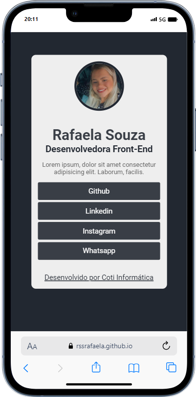
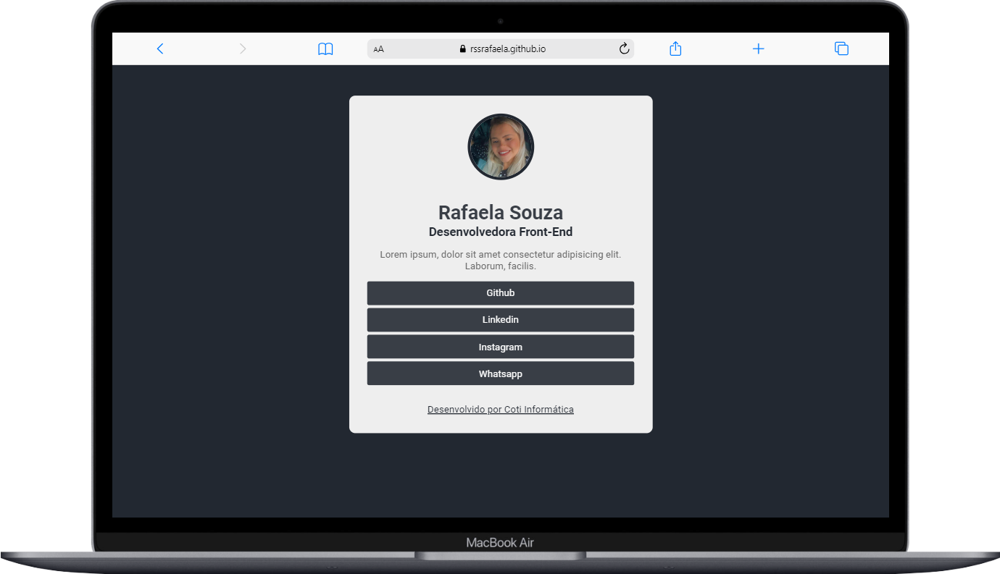

# Linktree Rafaela Souza

## 1. 📝 Descrição 

- Este é o meu primeiro projeto FrontEnd, desenvolvido como parte do curso Introdução ao Desenvolvimento Web na Coti Informática. Ele serve como um linktree pessoal, centralizando todos os links importantes em um único lugar, facilitando o acesso aos visitantes. Durante o desenvolvimento deste projeto, foram aplicados conhecimentos de HTML e CSS para criar um layout bonito e profissional, tornando a experiência de navegação agradável para o usuário.

## 2. Tecnologias Utilizadas

  -  HTML5
  -  CSS3
  -  Responsividade para Dispositivos Móveis
  -  Flexbox para Layouts

## 3. Aprendizados

Durante o curso, aprendi como:

- Criar um layout bonito e profissional usando HTML e CSS.
- Implementar responsividade para dispositivos móveis.
- Integrar links para redes sociais e outras plataformas.

## 4. 🎨 Layout

                          

### Mobile

  

     
### Desktop

  

     

## 5. 📁 Acesso ao projeto
- Click neste link : <a href="https://rssrafaela.github.io/projeto01/" target="_blank">Projeto01</a>

## 6. 🎯 Status do projeto

- Concluído ✅
